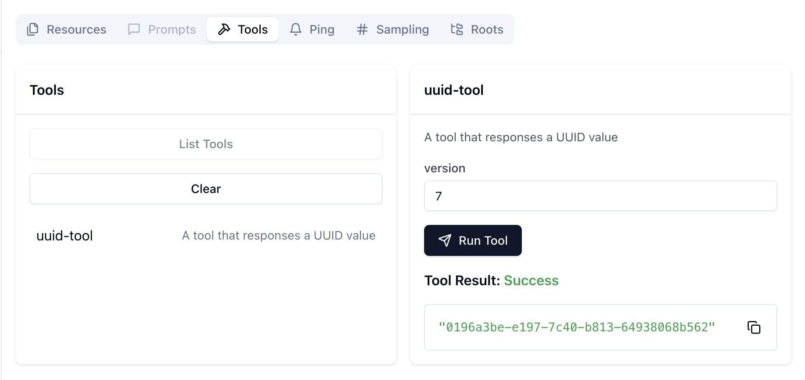

# mcp-uuid-go
An MCP server which responses UUID value.
Only support UUID version 4 or version 7.

## Quick Start
### 1. Build
```bash
cd mcp-uuid-go
go build -o build/uuidtool
```

### 2. Run with Inspector

```bash
cd inspector
npx @modelcontextprotocol/inspector --config ./config.json --server uuid-tool
```


